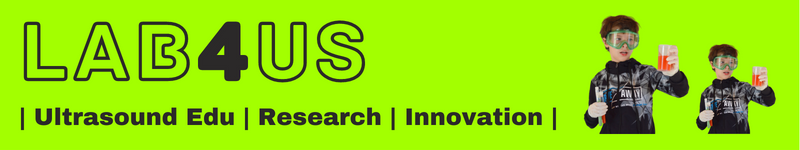

# US-Workshop @ FUW (2023)

***US-Workshop*** (czyli "Warsztaty Ultradźwiękowe") to cykl 3 spotkań, na które składa się wykład i część ćwiczeniowa.
Warsztaty zostały przygotowane w ramach inicjatywy [Lab4US](https://lab4us.eu) i są realizowane na Wydziale Fizyki UW.

#### Autorzy:
* Dr Marcin Lewandowski
* inż. Hanna Smach
#### Prowadzący:
* Dr Józef Ginter (Koordynator)
* Dr Marcin Lewandowski (wykłady/ćwiczenia)
* inż. Hanna Smach (ćwiczenia)

Email: <[hello@lab4us.eu](mailto:hello@lab4us.eu)>

## WSTĘP
### Dla kogo?
* Studenci 2+ roku fizyki, bioinżynierii, elektroniki, itp.
### Cel i zakres
* Podstawy fizyki ultradźwięków (zjawiska falowe).
* Zastosowania ultradźwięków w medycynie i przemyśle.
* Metoda Dopplera do oceny przepływu krwi.
* Podstawy obrazowania ultradźwiękowego.
### Wymagania
* Podstawy fizyki.
* Podstawy programowania w PYTHON.
* Środowisko Python-Jupyter lub konto na [Google Colab](https://colab.research.google.com/).

## KONTENT
### Spotkanie #1: ULTRADŹWIĘKI PODSTAWY
Podstawy fizyczne metod ultradźwiękowych oraz zastosowania ultradźwięków w medycynie i przemyśle.

### Spotkanie #2: ULTRADŹWIĘKOWA METODA DOPPLERA
Technika Doppler dla fal ultradźwiękowych do oceny przepływu krwi.

### Spotkanie #3: OBRAZOWANIE ULTRADŹWIĘKOWE
Podstawy medycznego obrazowania ultradźwiękowego - czyli ultrasonografia (USG).

 

 

***US-Workshop*** (i.e. "Ultrasound Workshop") is a series of 3 meetings consisting of a lecture and an exercise part.
The workshop has been prepared as part of the [Lab4US](https://lab4us.eu) initiative and is hosted at the Faculty of Physics, University of Warsaw.

 

<!-- BANNER -->

