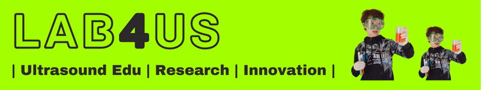

# US-Workshop @ FUW (2023)

***US-Workshop*** (czyli "Warsztaty Ultradźwiękowe") to cykl 3 spotkań, na które składa się wykład i część ćwiczeniowa.
Warsztaty zostały przygotowane w ramach inicjatywy [Lab4US](https://lab4us.eu) i są realizowane na Wydziale Fizyki UW.

#### Autorzy:
* Dr Marcin Lewandowski
* Hanna Smach
#### Prowadzący:
* Józef Ginter (Koordynator)
* Dr Marcin Lewandowski (wykłady/ćwiczenia)
* Hanna Smach (ćwiczenia)

Email: <[hello@lab4us.eu](mailto:hello@lab4us.eu)>

## PLAN
### Target
* Studenci 2+ roku fizyki.
### Wymagania
* Podstawy fizyki.
* Podstawy programowania w PYTHON.

Ultrasound-Workshop for the FUW (Faculty of Physics, University of Warsaw)

 

<!-- BANNER -->

